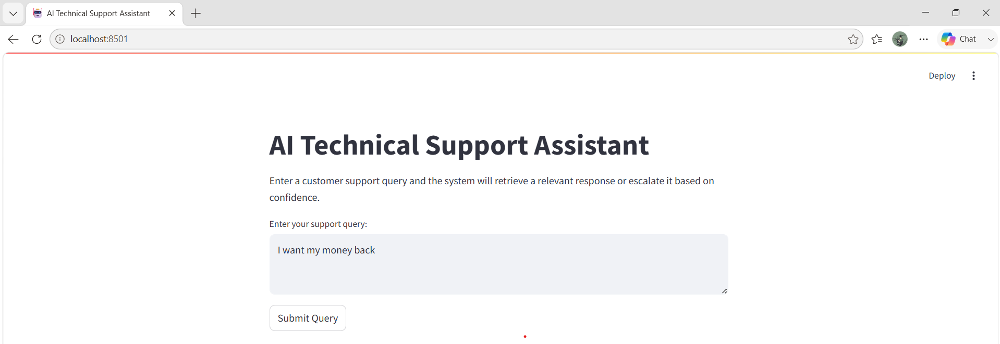
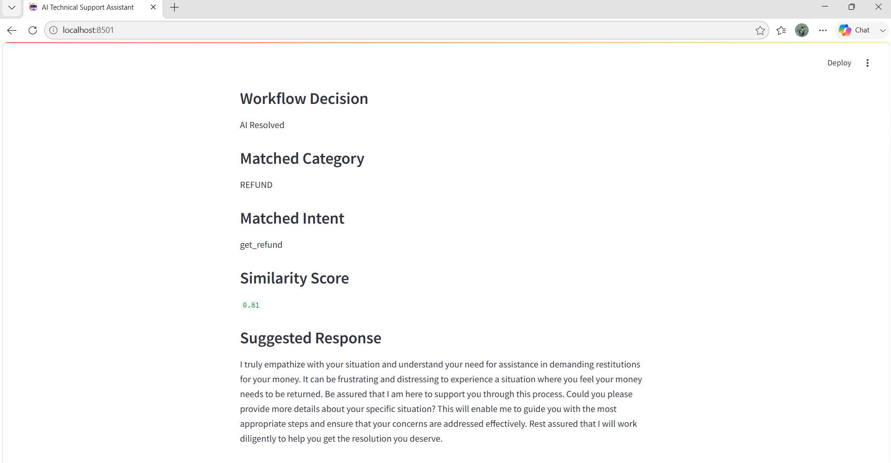

# AI Technical Support Assistant

An AI-powered customer support automation system that combines NLP preprocessing, retrieval-based response generation, workflow routing, escalation handling, and operational analytics.

The project simulates how modern customer support platforms automate repetitive customer interactions while escalating uncertain queries to human support agents.

Built using Python, Scikit-learn, NLP techniques, and Streamlit.

## Project Overview

This project was developed to explore how AI can assist customer support operations through intelligent query processing and retrieval-based automation.

The system uses Natural Language Processing (NLP), TF-IDF vectorization, cosine similarity retrieval, and confidence-based workflow routing to analyze customer queries and provide relevant support responses.

In addition to the AI assistant, the project includes workflow simulation and operational analytics modules to evaluate support performance, escalation behavior, and automation effectiveness.

## Key Features

- NLP Query Preprocessing and Enrichment
- TF-IDF Knowledge Base Retrieval
- Cosine Similarity Response Matching
- Confidence-Based Escalation Logic
- AI-Assisted Customer Support Workflow
- Workflow Simulation Engine
- Operational KPI Analytics
- Escalation Monitoring and Analysis
- Streamlit-Based Interactive Interface

## Application Preview

### Query Submission Interface

### AI Response Output

## Project Architecture

User Query
    ↓
Query Preprocessing
    ↓
TF-IDF Vectorization
    ↓
Cosine Similarity Retrieval
    ↓
Confidence Evaluation
    ↓
AI Response / Human Escalation

## Current Progress

- Completed customer support ticket data exploration and preprocessing
- Built retrieval-ready knowledge base
- Implemented TF-IDF vectorization and cosine similarity retrieval
- Developed query preprocessing and enrichment pipeline
- Implemented confidence-based escalation workflow
- Built workflow simulation engine for support operations
- Generated workflow analytics using 650 simulated support interactions
- Developed KPI tracking for AI resolution and escalation monitoring
- Conducted escalation trend analysis and workflow performance evaluation
- Modularized backend architecture into reusable Python modules
- Built a working Streamlit application for end-to-end support query handling
- Added application screenshots and deployment-ready project structure

## Future Improvements

- Semantic Search using Sentence Transformers
- Context-Aware Query Understanding
- Adaptive Confidence Thresholds
- Multi-Turn Support Conversations
- Advanced Analytics Dashboard
- Ticket Generation and Tracking System
- Streamlit Cloud Deployment
- Vector Database Integration

## Tech Stack

- Python
- Pandas
- NumPy
- Scikit-learn
- NLP
- TF-IDF Vectorization
- Cosine Similarity
- Streamlit
- Matplotlib
- Seaborn
